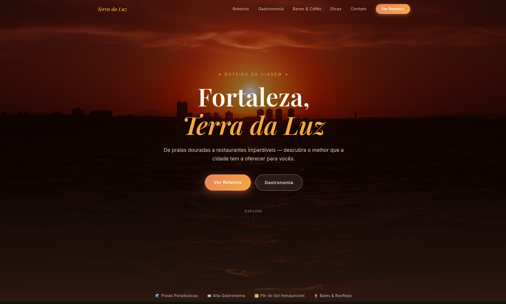
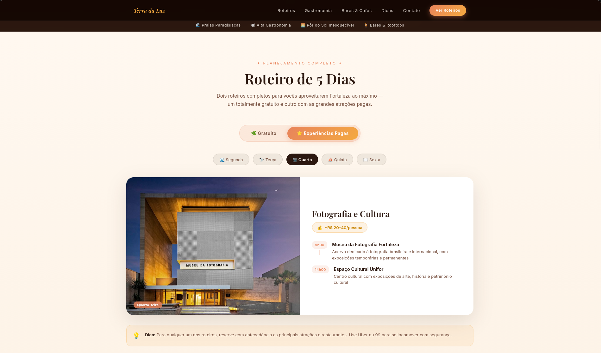
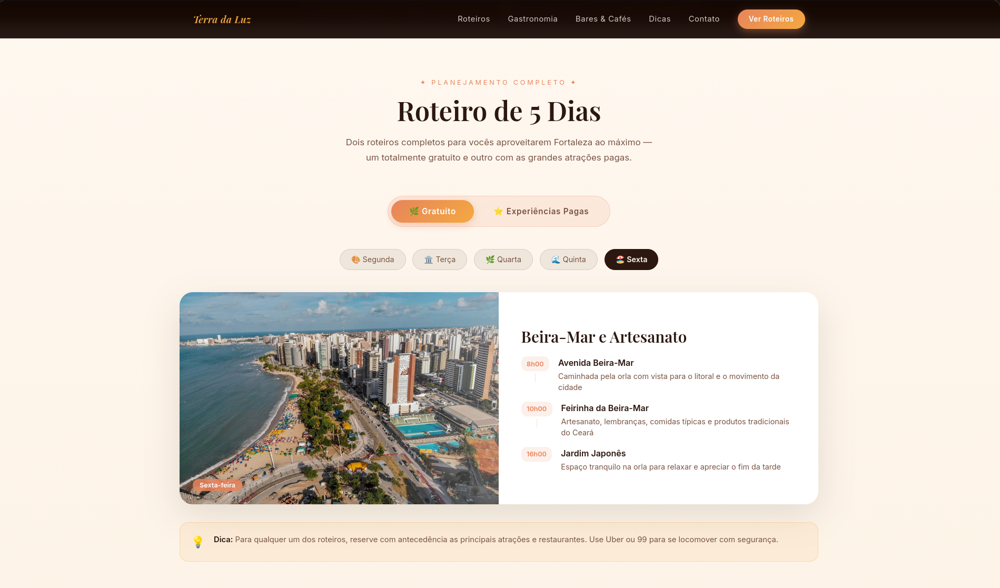
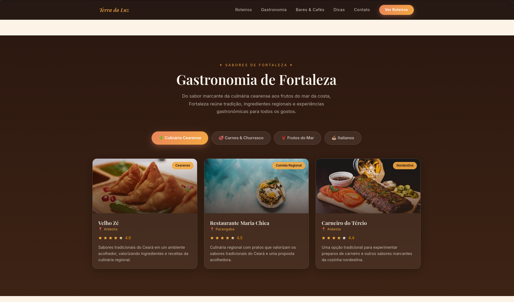
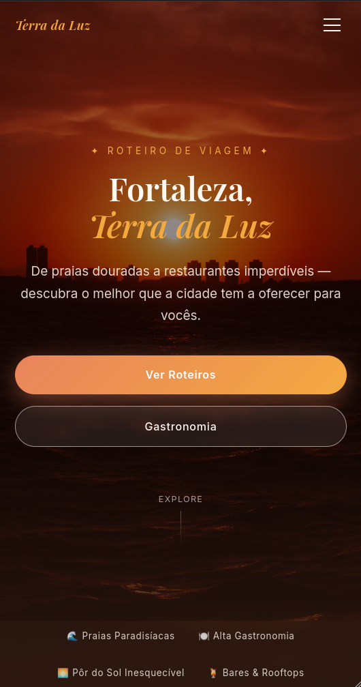

# 🌴 Terra da Luz

> Uma experiência digital para descobrir Fortaleza, a **Terra da Luz**.

O **Terra da Luz** é uma aplicação web desenvolvida como uma Single Page Application (SPA), criada para apresentar Fortaleza, Ceará, de uma forma moderna, acessível e interativa.

A plataforma reúne informações sobre **pontos turísticos, eventos, cultura, gastronomia, lazer e dicas para visitantes**, proporcionando uma experiência centralizada para quem deseja conhecer ou explorar a cidade.

---

## 🌅 Sobre o projeto

Fortaleza é uma das principais cidades turísticas do Nordeste brasileiro e possui uma identidade marcada por suas praias, cultura, gastronomia, arquitetura e vida urbana.

O nome **Terra da Luz** faz referência ao Ceará, conhecido historicamente por esse título devido ao pioneirismo na abolição da escravidão no estado.

A proposta do projeto é transformar essas características em uma experiência digital, permitindo que o usuário explore a cidade através de uma interface simples e intuitiva.

---

## 📸 Fortaleza — Terra da Luz

<div align="center">



</div>

---

## 🗺️ Explore Fortaleza

A aplicação apresenta diferentes categorias para ajudar o usuário a descobrir a cidade.

<div align="center">



_Principais pontos turísticos e espaços culturais de Fortaleza._

</div>

Entre os conteúdos apresentados estão:

- 🏖️ Praias e orla
- 🏛️ Pontos históricos
- 🎭 Cultura e arte
- 🍽️ Gastronomia
- 🎉 Eventos
- 🌳 Espaços de lazer
- 🛍️ Comércio e mercados
- 💡 Dicas para visitantes

---

## 🎭 Cultura e história

Fortaleza possui uma forte identidade cultural, presente em seus espaços históricos, manifestações artísticas, música, literatura e gastronomia.

<div align="center">



</div>

O projeto busca valorizar esses elementos e aproximar o visitante da história e da cultura local.

---

## 🌊 Pontos turísticos

A plataforma pode apresentar informações sobre locais como:

| Local                       | Categoria              |
| --------------------------- | ---------------------- |
| 🏖️ Praia de Iracema         | Praia / Lazer          |
| 🌅 Beira-Mar                | Orla / Turismo         |
| 🏛️ Centro Dragão do Mar     | Cultura                |
| 🛒 Mercado Central          | Gastronomia / Compras  |
| ⛪ Catedral Metropolitana   | História / Arquitetura |
| 🌳 Parque do Cocó           | Natureza               |
| 🎡 Centro Cultural Belchior | Cultura                |
| 🏘️ Centro Histórico         | História               |

<div align="center">

</div>

---

## 📅 Eventos

O Terra da Luz também possui uma área destinada à descoberta de eventos.

O usuário pode visualizar informações como:

- Nome do evento
- Data
- Horário
- Local
- Categoria
- Descrição
- Informações adicionais

<div align="center">



_Interface de descoberta de eventos._

</div>

---

## 💡 Dicas para visitantes

Além de pontos turísticos e eventos, a aplicação apresenta recomendações úteis para quem está conhecendo Fortaleza.

### 🔒 Segurança

Informações básicas para ajudar o visitante a se deslocar pela cidade com mais segurança.

### 🚌 Transporte

Orientações sobre deslocamento e alternativas de transporte.

### ☀️ Clima

Informações úteis para planejar passeios e atividades ao ar livre.

### 🍽️ Gastronomia

Sugestões de experiências gastronômicas e pratos característicos da região.

---

## 🖥️ Interface

A aplicação foi pensada para oferecer uma experiência:

- 📱 Responsiva
- ⚡ Rápida
- 🎨 Moderna
- 🧭 Intuitiva
- ♿ Acessível
- 🌐 Adaptada para dispositivos móveis e desktop

<div align="center">



_Interface da aplicação em mobile._

</div>

---

## 🛠️ Tecnologias utilizadas

O projeto utiliza tecnologias modernas para desenvolvimento web:

### Front-end

- **React**
- **TypeScript**
- **Vite**
- **Tailwind CSS**
- **Lucide React Lib**

---

## 🚀 Como executar

Clone o repositório:

```bash
git clone https://github.com/Leonardo-de-Moura/TerradaLuz
```

Entre na pasta:

```bash
cd TerradaLuz
```

Instale as dependências:

```bash
npm install
```

Execute o projeto em desenvolvimento:

```bash
npm run dev
```

A aplicação estará disponível no endereço informado pelo Vite no terminal.

---

## 🎯 Objetivos

O projeto tem como principais objetivos:

1. **Valorizar Fortaleza e a cultura cearense.**
2. Facilitar o acesso a informações turísticas.
3. Reunir eventos e atrações em um único ambiente.
4. Criar uma experiência digital moderna para visitantes.
5. Incentivar a exploração dos espaços culturais e turísticos da cidade.
6. Demonstrar a utilização de tecnologias modernas de desenvolvimento web.

---

## 🌴 Terra da Luz

Mais do que um guia turístico, o projeto busca representar a identidade de Fortaleza através da tecnologia.

**Praias, cultura, história, gastronomia e pessoas.**

Tudo em um só lugar.

<div align="center">

### ☀️ Bem-vindo à Terra da Luz.

**Fortaleza, Ceará — Brasil 🇧🇷**

</div>
